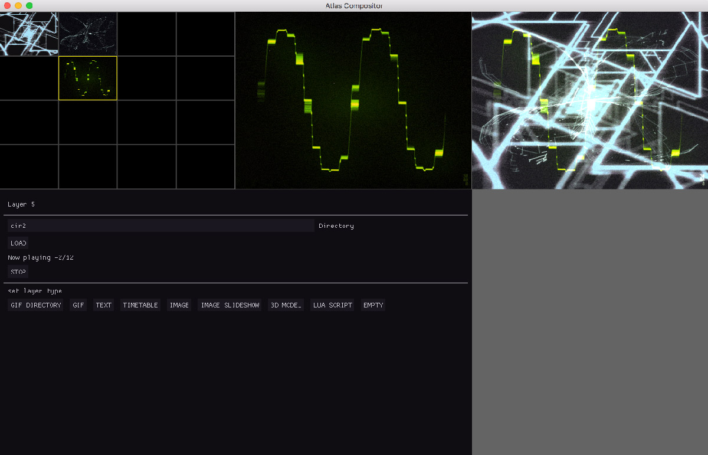

# atlas
VJ Application prototype using OpenFrameworks and ImGui.



## Planned features
* play animated ```gif``` (or directory with gifs)
* ```ffmpeg``` video
* text layer using custom ```.ttf``` font

## Reference

* GifDecoder based from https://github.com/waynejo/android-ndk-gif
